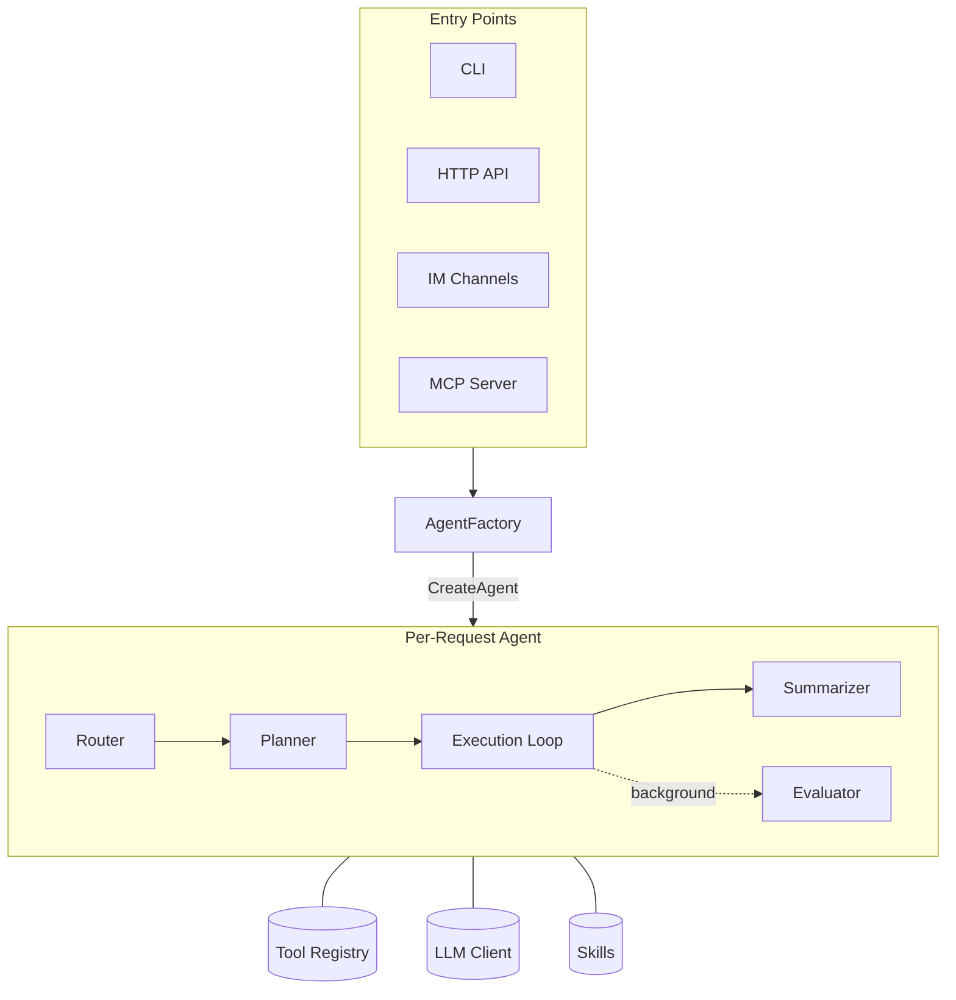

# AgeAge

**A self-hosted AI agent framework in Go.** Wire any OpenAI-compatible LLM to a tool loop, teach it custom workflows with Markdown skill files, and reach it from a terminal, a chat room, or your own client — all from a single binary with a single config file.

---

## Why AgeAge

Most AI agent frameworks are heavy, unpredictable black boxes that blindly consume tokens and require massive Python environments. AgeAge takes a different approach: **maximum token efficiency, strict predictability, and zero deployment friction.**

### Core Philosophy

**1. Context Economy & Token Efficiency** — AgeAge aggressively protects your context window. An intelligent **Router** intercepts user intents, directing simple queries to cheap models and reserving strong models for complex reasoning. Deep tasks are offloaded to isolated **sub-agents** via delegation, keeping the main session clean and strictly scoped.

**2. Semi-Automated Predictability (Pipelines)** — LLMs are inherently non-deterministic, making repetitive workflows fragile. AgeAge introduces **YAML Pipelines** as an escape hatch: chains of LLM-driven `agent` nodes and deterministic `auto` nodes (direct tool calls, no reasoning). You only invoke the AI when cognitive work is actually required, eliminating infinite loops and guaranteeing reproducibility.

**3. Transparent Execution & Zero-Leak Security** — In supervised mode, destructive actions pause for explicit confirmation. More importantly, **your secrets never touch the cloud**. Through an encrypted local vault and `{{cred:name}}` placeholders, the LLM requests authenticated actions without ever seeing the actual passwords or API keys.

**4. First-Class Multi-Platform UX** — Whether you are in the terminal (`ageage cli`) or a group chat (Telegram, Discord, Matrix), the experience is tailored. Multi-session management works out of the box — every Matrix thread automatically spawns an isolated, persistent agent session. The CLI features live reasoning streams, inline file attachments (`@file`), and conversational rollbacks (`/undo`).

**5. Ultra-Lightweight Single Binary** — Written in Go, AgeAge deploys as a single standalone executable. It consumes **less than 10 MB of RAM at idle**, starts instantly, and requires zero heavy dependencies to run the core engine.

---

## Delivery modes

| Mode             | Command            | Description |
|------------------|--------------------|-------------|
| **Interactive CLI**  | `ageage cli`       | Development, debugging, power-user tasks. `/session`, `/clear`, `/build`, `/retry`, `@file` attachments. |
| **IM channels**      | `ageage connect`   | Telegram, Discord, Matrix. Per-room session management, typing indicators, ⏳/✅ reactions, thread sessions. |
| **HTTP API**         | `ageage serve`     | OpenAI-compatible `/v1/chat/completions`. Drop-in backend for SillyTavern, OpenWebUI, and similar clients. |
| **MCP server**       | `ageage mcp`       | Expose all registered tools as MCP tools over stdio so other AI systems can call them. |

---

## Quick start

```sh
# 1. Clone and build
git clone https://github.com/your-org/ageage
cd ageage
go build -o ageage .

# 2. Create a workspace with a starter config
./ageage init

# 3. Start chatting
./ageage cli
```

Minimum config:

```toml
[llm]
api_key  = "sk-..."
base_url = "https://api.openai.com/v1"
model    = "gpt-4o-mini"
```

Full configuration reference: [docs/config.md](docs/config.md)

---

## Architecture overview



### Key components

**AgentFactory** is the single initialization point. It loads config, establishes the LLM client, compiles skills, and wires up all shared resources (cron store, MCP sessions, security checker, credential manager). Every agent instance comes from the factory and shares underlying config without duplicating state. A **skill watcher** goroutine polls the skills directory every 2 seconds and hot-reloads `.md` and `.yaml` files on any change.

**Agent** is the conversation engine. It holds the full message history, the tool registry, the router, and the summarizer. One instance persists across turns; history grows with each exchange and is compressed or summarized when it exceeds configurable thresholds.

**Router** is an optional lightweight classifier that runs before each turn. It answers three factual yes/no questions about the request (`needs_tools`, `needs_multiple_calls`, `needs_synthesis`) and lists the required tools. The engine derives the model tier (`base`/`medium`/`strong`) from the checklist — eliminating semantic bias from manual labelling. The router also selects the active skill.

**Planner & Evaluator** work together for complex tasks with no existing skill. The Planner runs a sandboxed agent to author a new `.md` or `.yaml` skill file. Afterwards, the Evaluator runs asynchronously in the background to review the execution and potentially patch the generated skill. The `/build` command also triggers the Planner explicitly, passing recent conversation context.

**Tool Registry** is a simple map with thread-safe register/execute methods. Global tools are always available; **skill-only tools** (`grep`, `glob`, `browser_*`, `update_todos`, `escalate`) are injected at the start of a matched turn and removed when it returns.

---

## Request flow (one user turn)

```
User message
    │
    ▼
① Skill matching — word-boundary name match against loaded skills
② Skill-only tool injection — add declared tools; remove on turn exit (defer)
③ Router (optional) — answer 3 checklist questions; derive model tier; select tools & model
④ Planner (optional) — if tier=strong and no skill exists, auto-generate one
⑤ Model & tool selection
    base   → [llm] model, no delegate
    medium → [router.medium] model if configured
    strong → [router.strong] model, delegate injected
⑥ Execution loop (up to max_iterations)
    LLM call → tool calls → LLM call → …
    <think> blocks stripped from streamed output
    Oldest turns compressed in-place to save tokens
    finish_task(status, summary) called → save history → return
    [Guard] finish_task(status="success") blocked if any todo is still pending
⑦ Post-turn summarization & Evaluator
    Background summarization (optional)
    Background evaluator for auto-generated skills
```

---

## Token efficiency

| Strategy                 | Effect |
|--------------------------|--------|
| **KV cache stability**   | System prompt is byte-identical every turn. Dynamic info (time, todos) is in an ephemeral trailing message — never stored in history. |
| **In-place compression** | Tool-call turns older than the 2 most recent are collapsed into a one-line narrative message. |
| **Tool result capping**  | Tool outputs in history are capped at 4 000 runes; the full result is used by the current iteration. |
| **Conversation summarization** | After a threshold, old pairs are replaced by an LLM-generated summary. |
| **Router model tiering** | Simple tasks stay on the base model; only complex multi-step tasks escalate to the strong model. The router itself runs on a cheap classifier model. |

---

## Skills

Skills live in `{workspace}/skills/`. Any `.md` file with valid frontmatter is picked up automatically.

```markdown
---
name: code-review
description: "Review code for bugs, style, and security."
tier: medium
required_tools:
  - file_read
  - grep
---

Read the given file(s) and return a structured review with severity ratings.
```

| Frontmatter field  | Purpose |
|--------------------|---------|
| `name`             | Word-boundary matched against user input (case-insensitive, spaces/underscores/hyphens equivalent). |
| `description`      | Shown to the router for skill selection. |
| `tier`             | `base` / `medium` / `strong` — bypasses the router LLM call when set. |
| `required_tools`   | Tool allowlist for this turn. |

### Model tiers

| Value    | Model used             | Delegate tool |
|----------|------------------------|---------------|
| `base`   | Base `[llm]` model     | No            |
| `medium` | `[router.medium]` model (if set) | No  |
| `strong` | `[router.strong]` model (if set) | Yes |

Multiple skills can match simultaneously. Their tool lists merge and the highest tier wins. Skills are **hot-reloaded** — the change applies within 2 seconds.

### Pipeline skills

Skills can define structured multi-step pipelines in YAML — chains of sub-agent nodes, direct tool calls, and foreach loops — instead of a single prompt body. See [docs/skills.md](docs/skills.md) for the full pipeline reference.

### `/build` command

Type `/build [description]` to explicitly trigger the Planner from any mode. The Planner receives the last 8 turns of conversation as context and authors a new skill or pipeline file — without adding any of the build process to the main conversation history.

```
/build create a daily GitHub notification summarizer
```

---

## Sub-agents and delegation

The `delegate` global tool and `escalate` skill-only tool each spawn an isolated sub-agent with its own registry and iteration budget. Sub-agents do not run the router and do not inherit personality files, giving clean isolation for complex tasks.

`delegate` uses `[subagent.model]`; `escalate` always uses `[router.strong]`.

---

## Multimodal attachments

**CLI** — attach files inline with `@path` syntax:

```
You ▸ Summarise @report.pdf and check @screenshot.png for issues
```

**HTTP API** — multimodal `content` arrays in request bodies are forwarded directly to the agent.

Images are sent as `image_url` parts when `multimodal.vision = true`; non-image documents are converted to text via configurable converter commands (`pdftotext`, `libreoffice`, etc.).

---

## LLM compatibility

`llm.Client` wraps any OpenAI-compatible endpoint.

**Google Gemini** — when `base_url` contains `generativelanguage.googleapis.com`, a compatibility layer:
- Merges multiple system messages into one (Gemini requires exactly one)
- Merges consecutive same-role plain-text messages
- Strips `reasoning_content` from outbound messages
- Preserves `thought_signature` on tool calls for Gemini's verification round-trip

---

## Security model

- **`blocked_commands`** — substring blocklist on every `bash` invocation
- **`allowed_roots` / `forbidden_roots`** — path allowlist/denylist for all file tools; symlinks are fully resolved before checking
- **Supervised mode** — destructive tools pause for `y / n / a` confirmation; `bash.auto_allow_commands` defines prefix patterns that skip confirmation in that directory
- **`credentials.toml`** — unconditionally blocked from all file tools regardless of config; cannot be overridden
- **IM group chats** — bot only responds when @mentioned or replied to; `allowed_users` must be configured or group messages are denied

### Credential system

Named secrets are stored AES-256-GCM encrypted. The master key lives at `os.UserConfigDir()/ageage/master.key` — separate from the workspace so the credential file cannot be decrypted even if the workspace is leaked.

```sh
ageage cred add <name>     # prompt for value (no terminal echo)
ageage cred list           # list names (never values)
ageage cred remove <name>
```

The agent uses `{{cred:name}}` placeholders in tool arguments. Values are substituted in-memory just before execution and scrubbed from all results before they enter conversation history.

---

## Configuration quick-start

```toml
[llm]
api_key  = "sk-..."
base_url = "https://api.openai.com/v1"
model    = "gpt-4o-mini"

[agent]
max_iterations = 20
mode           = "supervised"   # "full" skips all confirmations

[router]
enabled = true

[router.classifier]             # Fast cheap model for classification
model    = "gemini-2.0-flash"
api_key  = "AIza..."
base_url = "https://generativelanguage.googleapis.com/v1beta/openai/"

[router.strong]                 # Best model for complex/workflow tasks
model = "gpt-4o"

[eval]                          # Auto-generated skill quality checker
success_threshold = 3

[pipeline]                      # Pipeline execution overrides
foreach_concurrency = 4
```

Run `ageage init` for an interactive setup wizard.

Full reference: [docs/config.md](docs/config.md) · [docs/skills.md](docs/skills.md) · [docs/tools.md](docs/tools.md)

---

## Directory layout

```
ageage/
├── agent/          # Agent loop, factory, router, planner, evaluator, sessions
├── channel/        # IM connectors (Telegram, Discord, Matrix)
├── config/         # TOML config structs and loader
├── creds/          # AES-256-GCM credential store
├── docs/           # config.md, skills.md, tools.md, pipeline.md
├── llm/            # OpenAI-compatible HTTP client + Gemini compatibility layer
├── security/       # Command and path safety checker
├── server/         # HTTP API (OpenAI-compatible) and MCP server
├── skills/         # Skill loader and hot-reload watcher
├── tools/          # All tool implementations
├── cliui.go        # Lipgloss CLI UI
└── main.go         # CLI entrypoint (cobra)
```

---

## Dependencies

| Package | Purpose |
|---------|---------|
| `github.com/BurntSushi/toml` | Config file parsing |
| `github.com/PuerkitoBio/goquery` | HTML extraction fallback |
| `codeberg.org/readeck/go-readability/v2` | Mozilla Readability content extraction |
| `github.com/modelcontextprotocol/go-sdk` | MCP client and server |
| `github.com/playwright-community/playwright-go` | Browser automation |
| `github.com/charmbracelet/lipgloss` | Terminal UI styling |
| `github.com/spf13/cobra` | CLI command structure |
| `gopkg.in/yaml.v3` | Skill frontmatter parsing |

---

## License

[MIT](LICENSE)
